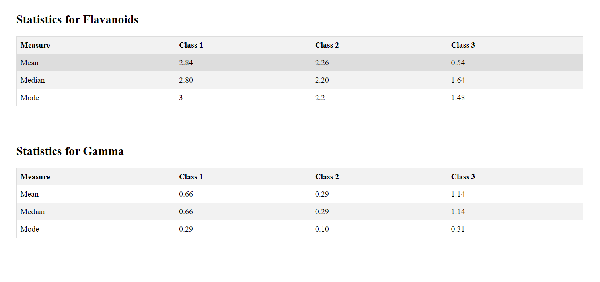

# Wine Dataset Analysis with React

This project is a simple React application to analyze a wine dataset. It calculates class-wise mean, median, and mode of the "Flavanoids" and "Gamma" attribute for the entire dataset. The "Alcohol" property is used to denote the class of each wine sample.

## Prerequisites

To run this project, you need to have Node.js and yarn installed on your machine.

## Getting Started

1. Clone this repository to your local machine.
2. Navigate to the project directory.
3. Install dependencies by running `yarn install` in the terminal.
4. Start the development server by running `yarn start` in the terminal.
5. Open your web browser and visit `http://localhost:3000` to view the application.

## Usage

1. Update the `wineData` array in `src/wine-data.json` with your wine dataset. Each entry in the array should be an object representing a wine sample with "Alcohol" and "Flavanoids" and "Gamma" properties.
2. The application will automatically calculate statistics and display them in a tabular format on the homepage.

<!-- ## File Structure -->

- `src/Flavanoids.jsx`: React component to display Flavanoids statistics in a table format.
- `src/Gamma.jsx`: React component to display Gamma statistics in a table format.
- `src/wine-data.json`: Contains the wine dataset.
- `src/utils/utils.js`: Contains utility functions to calculate mean, median, and mode.  

 